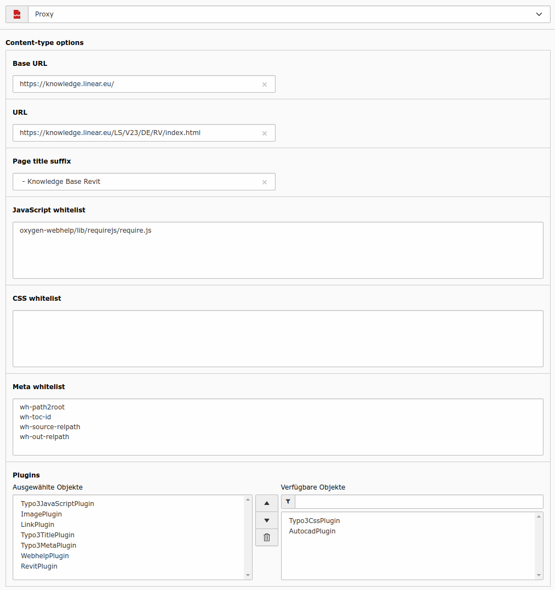

# proxy - TYPO3 Extension
Proxy extension for embedding external HTML sources. You can integrate your own filters to optimize the output.


# Screenshot


# Installation
* Only composer mode is supported

## How to integrate your own filters

You can integrate your own filters to optimize the output. The filter must extend the `WapplerSystems\Proxy\Plugin\AbstractPlugin` and must be registered in the `ext_localconf.php` of your extension.

Example:
```php
if (!isset($GLOBALS['TYPO3_CONF_VARS']['EXTCONF']['proxy']['plugins'])) {
    $GLOBALS['TYPO3_CONF_VARS']['EXTCONF']['proxy']['plugins'] = [];
}
$GLOBALS['TYPO3_CONF_VARS']['EXTCONF']['proxy']['plugins'] = array_merge($GLOBALS['TYPO3_CONF_VARS']['EXTCONF']['proxy']['plugins'],[
  'WebhelpPlugin' => WebhelpPlugin::class,
  'RevitPlugin' => RevitPlugin::class,
  'AutocadPlugin' => AutocadPlugin::class,
]);
```

